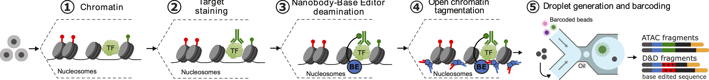
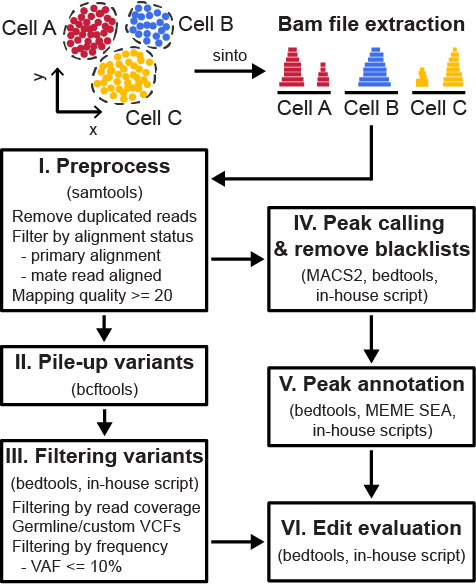
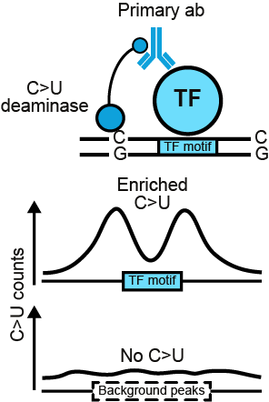

# **D&Dseq: Docking and Deamination followed by sequencing** 

(https://www.landaulab.org)



The symphony of gene expression is generated by an orchestra of transcription factors (TFs), whose binding to the genome is directed through multiple interconnected epigenetic signals, including chromatin accessibility and histone modifications. These complex networks have been shown to be disrupted in cells during aging, disease or cancer. However, profiling of these networks across diverse cell types and states is lacking, due to technical limitations of current methods for mapping DNA:protein interactions in single cells. This has resulted in a large gap in knowledge about where TFs or other chromatin remodelers bind to DNA, and how this binding is perturbed in pathological contexts in humans. To address this challenge, we have developed a versatile, high-throughput single-cell immuno-tethering DNA:Protein mapping technology that couples a species-specific antibody-binding nanobody to a cytosine base editing enzyme. Combined with single-cell ATAC-seq, this approach enables the profiling of even weak or transient factor binding to DNA in single-cells through identifying cytosine to uracil edits in target genomic regions following tagmentation and sequencing. Importantly, this Docking & Deamination followed by sequencing (D&D-seq) technique is easily incorporated into common single-cell multiomics workflows, allowing for multimodal analysis of gene regulation in single cells. We demonstrate the ability of D&D-seq to precisely profile CTCF and GATA1 binding in bulk as well as single-cell analyses of both cell lines and primary human cells. We further integrated D&D-seq with single-cell genotyping to assess the effect of IDH2 mutations on CTCF binding in human clonal hematopoiesis, identifying altered CTCF binding patterns in mutant cells. Altogether, the ability to directly measure TF or chromatin remodeler binding in primary human samples using high-throughput single-cell sequencing will empower novel discoveries relating to chromatin and transcriptional regulation in human cells across physiological and disease contexts, at unprecedented scale and resolution.


## Computational pipeline for D&D analysis

### Extraction of D&D signal

To summarize genome edits introduced by DnD in scATAC-seq data, a bam file produced by CellRanger was split into each cell type based on barcode sequence and cell annotation using sinto. For bulk ATAC-seq data, bam files aligned to the genome using BWA-MEM2 were analyzed. After splitting bam files, the following six steps were performed to analyze DnD-mediated genomic variants. 

1. First, each bam file was preprocessed to remove uninformative and low quality read alignments. Duplicated reads were marked and simultaneously filtered using “picard MarkDuplicates” with a REMOVE_DUPLICATES=true parameter. Read alignments with high mapping quality Phred score (>= 20), primary alignment, reads aligned to intact chromosomes, and those with properly aligned mates were retained using samtools (version 1.19). 
2. Next, all single nucleotide variants (SNVs) found in each filtered bam file were collected using “bcftools mpileup” with following parameters, -a FORMAT/AD,FORMAT/DP,INFO/AD --no-BAQ --min-MQ 1 --max-depth 8000. The pileup result subsequently converted into the vcf format reporting SNVs supported by at least two reads supporting variants from minimum three aligned reads. These thresholds can be adjusted by users based on their data.
3. Germline mutations were then filtered based on loci and alleles from the gnomAD database and variant allele frequency higher than 10%. If available, custom databases in vcf format can be provided to additionally filter uninformative mutations. 
4. Preprocessed bam files from step 1 were analyzed using MACS2 (version 2.2.9.1) to call peaks with -f BAM --nomodel parameters. Peaks were then filtered with blacklist region annotation using bedtools (version 2.31.1). Motif analysis was performed using MEME Simple Enrichment Analysis (SEA) with HOmo sapiens COmprehensive MOdel COllection (HOCOMOCO) v11 core motif set to identify binding sites in peaks. Optionally, users can perform motif analysis using HOMER2 or a reference bed file generated by ChIP-seq.
5. Peaks harboring motifs of interest or overlapping with ChIP-seq reference tracks were classified as target peaks. Target peaks were resized to 200 bp (up/downstream 100 bp from the motif center or peak summit with ChIP-seq) and overlaid with C-to-T and G-to-A variants identified in step 3. When multiple motif positions were found, a position with the highest motif score was chosen. Peaks without binding motifs of interest are classified as background peaks and were resized to 200 bp by taking +/- 100 bp from the peak summit.




### Evaluation of D&D signal

To compare D&D edit counts between target and background regions, edit counts per peak were summarized and signal-to-noise ratio (SNR) were calculated by dividing the number of C-to-T and G-to-A by the number of other variants. First, edits per peak were calculated by dividing SNV counts by the number of peaks in resized target and background peak regions. We assume that the frequencies of non-D&D edit (edits other than C-to-T) are consistent across the target and background regions, so this can be used to normalize the D&D edit counts. In this manner, SNR was then calculated by dividing the D&D edit counts by the mean of non-D&D edit counts. 

Footprint analysis for D&D edits was performed by counting the number of D&D edits in each base pair from randomly sampled target and background peaks, +-100 bp from the center of the motifs. The random sampling was repeated for 10 times and mean and standard deviation were used for visualization. For both the cell mixing experiment and primary blood cells, we used 200 randomly selected peaks. The number of subsampled peaks can be set by the user. 





### Prerequisite for D&D analysis

Following tools are required to run D&D analysis (more efficient version is coming). For most users, we recommend to install conda or mamba virtual environment to install these programs. For package installation and management, please advise with conda/mamba manuals. 

D&D pipeline was tested on Python 3.9.19 and R 4.3.3 using mamba (https://mamba.readthedocs.io/en/latest/). 

rtrackpayer (Bioconductor, https://doi.org/doi:10.18129/B9.bioc.rtracklayer), ggplot2, and reshape2 are required.

HOMER2 can be downloaded from https://homer-fnirs.org

MEME Suite can be downloaded from https://meme-suite.org/meme/doc/download.html

Other dependencies and requirements are specified in [main/environment](main/environment).

Core tools required are,
| **tool** | **tested version** |
| -------- | -------- |
| Python   | 3.9.19   |
| picard   | 3.1.1    |
| samtools | 1.19     |
| bcftools | 1.21     | 
| bedtools | 2.31.1   |
| bedops   | 2.4.41   | 
| vcf2bed  | 2.4.41   |
| macs2    | 2.2.9.1  |
| HOMER    | 4.11.1   |
| MEME     | 5.5.5    |

| **database** | **note** |
| -------- | ------- |
| ENCODE blacklist   | https://doi.org/10.1038/s41598-019-45839-z   |
| HOCOMOCO motif DB | included in MEME package https://meme-suite.org/meme/doc/download.html   |
| gnomAD germline DB | https://console.cloud.google.com/storage/browser/gatk-best-practices/somatic-hg38/    |
|                    | filtered version used in the paper is available at https://doi.org/10.6084/m9.figshare.27956862 |

**important note**
Bam files for samples, cell cluster or subclusters should be prepared in the following manner. For single-cell data, bam files can be separated by user-provided clusters using sinto. Please refer to the sinto's manual (https://timoast.github.io/sinto/).

```
$ tree bams

bams
├── ca46_ctcf
│   ├── ca46.5perc.bam
│   └── ca46.5perc.bam.bai
└── k562_gata1
    ├── k562.10perc.bam
    └── k562.10perc.bam.bai
```

## Running D&D analytic pipeline

D&D signals are collected and evaluated with three-step python scripts. By default, D&D edits will be called with motif analysis using MEME Simple Enrichment Analysis (SEA). Users can instead run HOMER2 with their own build or ChIP-seq as reference. 

**Part 1: preprocessing, collecting and filtering variants, and first round peak calling**

*faster version is coming soon
```
$ python dnd_pt1.py -h

usage:  [-h] -d DIR [-o OUTPUT] [--thread THREAD] [--start START] [--end END] [--mapq MAPQ] [--chrom] [--smt-other OTHER] [--se] [--count COUNT] [--alt ALT] [--fasta FASTA] [--gnomad GNOMAD] [--pass-gnomad]
        [--custom CUSTOM [CUSTOM ...]] [--vaf VAF] [--snv SNV] [--gsize GSIZE] [--opt OPT] [--blacklist BLACKLIST] [--pass-bklist]

optional arguments:
  -h, --help            show this help message and exit
  -d DIR, --Dir DIR     directory path
  -o OUTPUT, --Output OUTPUT
                        [Global] (*optional) output directory path
  --thread THREAD       [Global] (*optional) number of threads; default is 4
  --start START         [Global] (*optional) the first directory index
  --end END             [Global] (*optional) the last directory index
  --mapq MAPQ           [Step 1] (*optional) threshold for mapping quality; default is 20
  --chrom               [Step 1] (*optional) do not filter non-chromosome
  --smt-other OTHER     [Step 1] (*optional) other filter parameters for samtools in "~"
  --se                  [Step 1] (*optional) input bam is single-end
  --count COUNT         [Step 2] (*optional) minimum total counts; default is 3
  --alt ALT             [Step 2] (*optional) minimum ALT counts; default is 2
  --fasta FASTA         [Step 2] (*optional) genome fasta (indexed) used in alignment; e.g. cellranger/fasta/genome.fa
  --gnomad GNOMAD       [Step 3] (*optional) path to gnomAD vcf file
  --pass-gnomad         [Step 3] (*optional) do not run gnomAD filering
  --custom CUSTOM [CUSTOM ...]
                        [Step 3] (*optional) custom vcf file(s) to filter, multiple files are accepted
  --vaf VAF             [Step 3] (*optional) filter mutations frequent than this value; e.g. 10 for 10perc; default is 10
  --snv SNV             [Step 4] (*optoinal) SNV patterns to search; e.g. --snv "C>T,G>A, G>C"; default is "C>T,G>A"
  --gsize GSIZE         [Step 5] (*optional) effective genome size for macs2 callpeak; default is hs (homo sapiens)
  --opt OPT             [Step 5] (*optional) other parameters for macs2 callpeak
  --blacklist BLACKLIST
                        [Step 5] (*optional) blacklist file; default is hg38-blacklist.v2.bed
  --pass-bklist         [Step 5] (*optional) do not run blacklist filtering
```

```
$ python dnd_pt1.py -d <path_to_bam_directory> -o <path_to_output_directory> --thread 12 
```

Expected outputs are step1-5 directories in <-o>
```
├── step1_preprocess
│   ├── ca46_ctcf
│   │   ├── ca46.5perc.bam
│   │   ├── ca46.5perc.bam.bai
│   │   └── step1_picard_deduplication.txt
│   └── k562_gata1
│       ├── k562.10perc.bam
│       ├── k562.10perc.bam.bai
│       └── step1_picard_deduplication.txt
├── step2_mpileup
│   ├── ca46_ctcf
│   │   └── ca46.5perc.pileup
│   └── k562_gata1
│       └── k562.10perc.pileup
├── step3_fltvcf
│   ├── ca46_ctcf
│   │   └── ca46.5perc.flt.vcf
│   └── k562_gata1
│       └── k562.10perc.flt.vcf
├── step4_snvs
│   ├── ca46_ctcf
│   │   ├── ca46.5perc.flt.CT_GA.SNVs.vcf
│   │   ├── ca46.5perc.flt.SNVs.vcf
│   │   ├── ca46.5perc.snvs.bam
│   │   └── ca46.5perc.snvs.bam.bai
│   └── k562_gata1
│       ├── k562.10perc.flt.CT_GA.SNVs.vcf
│       ├── k562.10perc.flt.SNVs.vcf
│       ├── k562.10perc.snvs.bam
│       └── k562.10perc.snvs.bam.bai
└── step5_peaks
    ├── ca46_ctcf
    │   ├── peaks_bkflt.narrowPeak
    │   └── summits_bkflt.bed
    └── k562_gata1
        ├── peaks_bkflt.narrowPeak
        └── summits_bkflt.bed

```


**Part 2: Joint peak calling and motif searching**

We found that having a common set of peaks in different samples is often convenient when comparing D&D edit signals. Part2 jointly calls peaks in all samples found in your <step5_peaks> directory and intersect with individual calls. Old peaks are moved to the <celltype_specific> directory in each sample. Users who do not wish to jointly call peaks can skip peak calling by specifying <--pass-peakcall>. Then, the script performs motif analysis using MEME Simple Enrichment Analysis (SEA) or HOMER2. Users can choose whether to use joint peak calls in <merged> directory or individual peak call by specifying the <--sample> argument. 


```
$ python dnd_pt2.py -h

usage:  [-h] -d DIR [-o OUTPUT] [--pass-peakcall] [--sample SAMPLE] --mode [{sea,homer2}] [--gsize GSIZE] [--opt OPT] [--blacklist BLACKLIST] [--pass-bklist] [--motif MOTIF] [--fasta FASTA]
        [--homer-ref HM2REF]

options:
  -h, --help            show this help message and exit
  -d DIR, --Dir DIR     directory path
  -o OUTPUT, --Output OUTPUT
                        [Global] (*optional) output directory path
  --pass-peakcall       [Global] (*optional) pass peak calling and perform motif analysis ONLY; default is DO NOT PASS
  --sample SAMPLE       [Global] (*optional if <--pass-peakcall>) motif analysis for which sample: "joint" or specify sample name; default is "joint"
  --mode [{sea,homer2}]
                        [Global] which mode: "sea", "homer2"; default is "sea"
  --gsize GSIZE         [Step 5] (*optional) effective genome size for macs2 callpeak; default is hs
  --opt OPT             [Step 5] (*optional) other parameters for macs2 callpeak
  --blacklist BLACKLIST
                        [Step 5] (*optional) blacklist file; default is hg38-blacklist.v2.bed
  --pass-bklist         [Step 5] (*optional) do not run blacklist filtering
  --motif MOTIF         [Step 5, --mode:sea] (*optional) motif reference; default is <HOCOMOCOv11_core_HUMAN_mono_meme_format.meme>
  --fasta FASTA         [Step 5, --mode:sea] (*optional) genome fasta (indexed) used in alignment; e.g. cellranger/fasta/genome.fa
  --homer-ref HM2REF    [Step 5, --mode:homer2] (*optional) homer2 reference; default is "grch38_crgatac"
```

```
$ python dnd_pt2.py -d <path_to_pt1_output_directory> --mode sea
```

This step will create a "merged" directory with joint peak calling results in "step5_peaks/", and intersected peaks in each sample's directory. Original MACS2 result files will be stored in "celltype_specific" directory in each sample.

```
└── step5_peaks
    ├── ca46_ctcf
    │   ├── celltype_specific
    │   │   ├── peaks_bkflt.narrowPeak
    │   │   └── summits_bkflt.bed
    │   ├── peaks_bkflt.narrowPeak
    │   └── summits_bkflt.bed
    ├── k562_gata1
    │   ├── celltype_specific
    │   │   ├── peaks_bkflt.narrowPeak
    │   │   └── summits_bkflt.bed
    │   ├── peaks_bkflt.narrowPeak
    │   └── summits_bkflt.bed
    └── merged
        ├── meme_sea
        │   ├── sea.html
        │   ├── sea.tsv
        │   ├── sequences.tsv
        │   └── sites.tsv
        ├── peaks_bkflt.fasta
        ├── peaks_bkflt.narrowPeak
        ├── summits_bkflt.bed
        └── unfiltered
            ├── peaks_bkflt.narrowPeak
            └── summits_bkflt.bed
            
```

**Part 3: Motif annotation and D&D edit evaluation**

```
$ python dnd_pt3.py -h

usage: --mode only supports homer2 or sea [-h] -d DIR [-o OUTPUT] [--size SIZE] [--rand RAND] --sample SAMPLE [--var VARIANTS] --mode [{chip,homer2,sea}] [--indiv-sea] [--chipseq CHIPSEQ]
                                          [--homer-ref HM2REF] [--motif MOTIF [MOTIF ...]]

options:
  -h, --help            show this help message and exit
  -d DIR, --Dir DIR     directory path
  -o OUTPUT, --Output OUTPUT
                        [Global] (*optional) output directory path
  --size SIZE           [Global] (*optional) test peak width size in bp; default is 200
  --rand RAND           [Global] (*optional) down-sample peaks to this number; default is 200
  --sample SAMPLE       [Global] specify <sample name> or <"all"> for all samples in <step5>
  --var VARIANTS        [Global] (*optional) expected D&D variants; default is "C>T,G>A"
  --mode [{chip,homer2,sea}]
                        [Global] which mode: "sea", "homer2" or "chip"
  --indiv-sea           [Global] (*optional, if --mode sea) specify when you analyzed SEA motif search for each sample separately
  --chipseq CHIPSEQ     [Step 6, --mode:chip] chip-seq reference
  --homer-ref HM2REF    [Step 6, --mode:homer2] (*optional) homer2 reference; default is "grch38_crgatac"
  --motif MOTIF [MOTIF ...]
                        [Step 6, --mode:homer2 or sea] <path to the homer2 motif file> for "homer2" or <TF name> for "sea", multiple arguments are supported
```

```
$ python dnd_pt3.py -d <path_to_pt1_output_directory> --sample ca46_ctcf --mode sea --motif CTCF_HUMAN.H11MO.0.A
$ python dnd_pt3.py -d <path_to_pt1_output_directory> --sample k562_gata1 --mode sea --motif GATA1_HUMAN.H11MO.0.A
```

This will generate "step6_tfpeaks_sea" directory with includes "sample" (in this example, k562_gata1).

Each "sample" directory has peaks, D&D edits, and footprint plots for TF binding peaks and background peaks. Users can define window size to collect D&D edits or the number of peaks to sample in footprinting plotting.

```
step6_tfpeaks_sea/
└── k562_gata1
    ├── background.countNormalized.txt
    ├── background.countPerPeak.txt
    ├── context_di
    ├── context_tri
    ├── dnd_countNormalized.pdf
    ├── dnd_countNormalized_SNR.pdf
    ├── motif_bkgd.narrowPeak
    ├── motif_bkgd.narrowPeak.CT_GA.vcf
    ├── motif_bkgd.narrowPeak.nonDnD.vcf
    ├── motif_bkgd.narrowPeak.vcf
    ├── motif_bkgd.narrowPeak.width200
    ├── motif_bkgd.narrowPeak.width200.CT_GA.vcf
    ├── motif_bkgd.narrowPeak.width200.nonDnD.vcf
    ├── motif_bkgd.narrowPeak.width200.vcf
    ├── motif_bkgd.narrowPeak.width200.vcf.bed
    ├── motif_bkgd.narrowPeak.width200.vcf.CT_+-5bp.bed
    ├── motif_bkgd.narrowPeak.width200.vcf.CT_+-5bp.fasta
    ├── motif_bkgd.narrowPeak.width200.vcf.GA_+-5bp.bed
    ├── motif_bkgd.narrowPeak.width200.vcf.GA_+-5bp.fasta
    ├── motif_bkgd.narrowPeak.width200.vcf.GA_+-5bp_revComp.fasta
    ├── motifCenteredCounts
    ├── motifCenteredCounts_nonDnD
    ├── motif_TF.narrowPeak
    ├── motif_TF.narrowPeak.CT_GA.vcf
    ├── motif_TF.narrowPeak.motifCentered.width200
    ├── motif_TF.narrowPeak.motifCentered.width200.CT_GA.vcf
    ├── motif_TF.narrowPeak.motifCentered.width200.nonDnD.vcf
    ├── motif_TF.narrowPeak.motifCentered.width200.vcf
    ├── motif_TF.narrowPeak.motifCentered.width200.vcf.bed
    ├── motif_TF.narrowPeak.motifCentered.width200.vcf.CT_+-5bp.bed
    ├── motif_TF.narrowPeak.motifCentered.width200.vcf.CT_+-5bp.fasta
    ├── motif_TF.narrowPeak.motifCentered.width200.vcf.GA_+-5bp.bed
    ├── motif_TF.narrowPeak.motifCentered.width200.vcf.GA_+-5bp.fasta
    ├── motif_TF.narrowPeak.motifCentered.width200.vcf.GA_+-5bp_revComp.fasta
    ├── motif_TF.narrowPeak.nonDnD.vcf
    ├── motif_TF.narrowPeak.vcf
    ├── motif_TF.narrowPeak.width200
    ├── motif_TF.narrowPeak.width200.CT_GA.vcf
    ├── motif_TF.narrowPeak.width200.nonDnD.vcf
    ├── motif_TF.narrowPeak.width200.vcf
    ├── resizedPeakCounts
    ├── resizedPeakCounts_nonDnD
    ├── target.countNormalized.txt
    └── target.countPerPeak.txt
```


Raw data is available at Gene Expression Omnibus ([GSEXXXXXX](https://www.landaulab.org))

